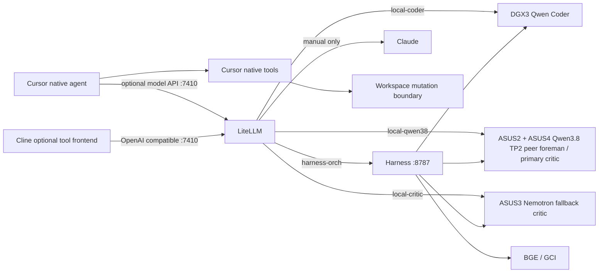

# Harness Architecture

## Runtime path



LiteLLM is the client-facing model router. Harness remains the orchestrator:
decomposition, gather, coder dispatch, critic grading, bounded repair, durable
state, and verification still run in Harness. SGLang serves inference only.

## Live allocation

- `DGX3 :8900`: Qwen3-Coder-Next SGLang with DFlash. This is the only
  dedicated coder and supports two to three concurrent agent requests.
- `ASUS2 + ASUS4 :8888`: Qwen3.8 Flash Next NVFP4 SGLang TP=2 with MTP2.
  This is the primary critic while M5 is foreman, plus the peer foreman and
  overflow lane. It is skipped as critic whenever it is the active foreman.
- `ASUS3 :8900`: Nemotron 3.5 Lightning NVFP4 SGLang with EAGLE. This is the
  secondary local critic and researcher, never the foreman.
- `M5 :8082`: Qwen3.8-27B-8bit primary foreman.
- `Spark e10b :8800` and GCI `:8810`: protected embedding/search services.
  Owners confirmed `:8800` loads FAE v4 weights while retaining a legacy v1
  API label. Never use it as a Tapes v1 baseline, flip its symlink, restart,
  or repurpose it.
- ASUS1 and DGX2 are not active coder routes. Their launchers and model
  artifacts remain available for future experiments.

The old vLLM launchers are retained as rollback assets. Do not delete model
weights or rollback scripts during routine cleanup.

## Gateway boundaries

LiteLLM binds only `127.0.0.1:7410`. Its explicit model IDs are:

- `harness-orch`: Harness orchestration through `127.0.0.1:8787`
- `local-coder`: direct DGX3 coder
- `local-qwen38`: direct Qwen3.8 TP2
- `local-critic`: direct Nemotron
- `frontier-claude`: explicit paid route

There is no automatic paid-cloud fallback. `frontier-claude` must be selected
by name. Provider credentials and `LITELLM_MASTER_KEY` are read from `.env`;
the real values must never be committed.

Harness `:8787` now exposes only `harness-orch`. Direct model forwarding,
provider translation, and gateway failover were removed after LiteLLM passed
tool, JSON, streaming, usage, auth, routing, concurrency, and latency gates.
Harness still keeps its internal worker ladder for orchestration.

## Operations

Install or repair LiteLLM:

```shell
scripts/install_litellm.sh install
scripts/install_litellm.sh status
scripts/install_litellm.sh restart
```

Install or repair the internal Harness orchestration service:

```shell
scripts/install_harness_orch.sh install
scripts/install_harness_orch.sh status
scripts/install_harness_orch.sh restart
```

Cursor remains the primary IDE and owns its native tools. Cline is restored as
an optional tool-executing frontend for the Harness orchestrator:

- provider: OpenAI Compatible
- base URL: `http://127.0.0.1:7410/v1`
- model: `harness-orch`
- API key: `LITELLM_MASTER_KEY` from the uncommitted `.env`

The client boundary is LiteLLM; Cline does not connect directly to physical
SGLang workers. `.clinerules`, `.vscode/cline-provider.txt`, and
`scripts/configure_cline.py` define and reproduce that setup.

Service checks:

```shell
curl http://127.0.0.1:8787/healthz
scripts/qwen_coder_sglang.sh status
scripts/nemotron_sglang.sh status
uv run harness fleet validate
```

The Qwen3.8 TP2 deployment settings are pinned in
`scripts/qwen38_sglang.env`. Preserve the working remote deployment and the
vLLM rollback recipe when changing it.

## Qualification

Run the local gateway and orchestration gates:

```shell
uv run python scripts/litellm_qualification.py
uv run pytest -q
uv run harness fleet validate
```

`litellm_qualification.py` does not call the paid frontier route. It verifies:

- model listing and rejected invalid authentication
- chat, JSON object mode, native tools, and multi-turn tool results
- streaming termination and finish reasons
- usage fields and three-request coder concurrency
- direct-versus-LiteLLM latency for all three SGLang services
- the complete `harness-orch` path
- absence of configured automatic fallback

Results are written beneath `results/`. Harness run, packet, critic, and
verification evidence remains in `results/harness.db` and task artifacts.

## M5 deployment sandboxes

Generated applications are staged under
`/Volumes/M5_4TB/harness-sandboxes` and run through the dedicated
`colima-harness-sandbox` Docker context. Application containers are ARM64,
non-root, capability-free, read-only, resource-bounded, and denied egress.
A separately labelled Caddy proxy is the only bridge to a loopback host port.

`harness sandbox up` publishes that loopback port at the root path of a
dedicated tailnet-only Tailscale HTTPS port. Preview routes, ownership
manifests, state hashes, and TTLs persist across process restarts. `down` and
TTL garbage collection remove the route before ownership-verified containers.
`harness build preview` additionally requires a completed greenfield run whose
workspace still matches its final verified state hash.

Operational commands and security constraints are documented in
`deploy/sandbox/README.md`.

## Tools and MCP

Cursor owns workspace mutation through its native file, search, terminal, Git,
approval, and UI tools. No filesystem or Git MCP server is installed.

An external MCP server may be added only when all of these are documented:

1. Cursor cannot access the service natively.
2. Allowed operations and canonical roots are explicit.
3. Credentials are environment-backed and least privilege.
4. Mutating operations retain an approval boundary.
5. Failure cannot bypass Harness verification or trigger paid fallback.

LangChain is not part of this stack. LiteLLM routes, SGLang serves, Harness
orchestrates, and Cursor provides tools.

## Configuration ownership

- `config/litellm.yaml`: client-visible routes and billing boundary
- `config/models.yaml`: physical/model endpoint definitions
- `config/workers.yaml`: Harness role allocation and priorities
- `config/gateway.yaml`: Harness orchestration identity and internal ladder
- `scripts/*_sglang.sh`: SGLang service lifecycle where locally managed
- `.env`: uncommitted credentials

Change YAML, run the qualification commands, then restart only the affected
service. There is no automatic discovery or hot reload.
