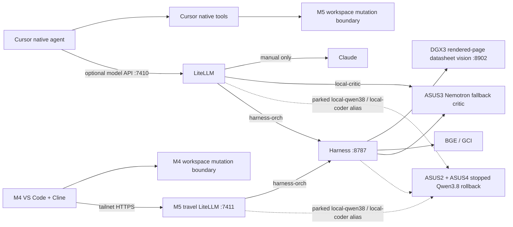

# Harness Architecture

## Runtime path



M5 is an always-on control plane, not an inference host. The M4 keeps the
repository and Cline tools local while sending model requests over tailnet
HTTPS to the restricted M5 travel gateway. Cline still owns tools, history,
compaction, approvals, and retries. `harness-orch` is selected only for an
explicit multi-model task; normal Cline work uses `local-qwen38` or
`local-coder` compatibility alias. Harness owns decomposition, worker dispatch, critic grading,
bounded repair, durable state, and verification. SGLang serves inference only.

## Live allocation

- `DGX3 :8902`: Qwen3-VL-30B-A3B-Instruct FP8 behind the datasheet pillar:
  PyMuPDF and `pdftotext -layout` first, exact package/table geometry next,
  local text extraction next, and focused table/column vision only when the
  text answer fails evidence gates. Full-page definition-table inference is
  prohibited. Its former Qwen3-Coder-Next container is retained stopped as a
  rollback asset.
- `ASUS2 + ASUS4`: the qualified Qwen3.8 Flash Next NVFP4 TP=2 service is
  stopped while both GPUs participate in vision training. Its weights,
  launch configuration, and `local-coder`/foreman routes remain rollback
  assets. Restore that service only when its serving utility exceeds the
  value of the active training workload.
- `ASUS3 :8900`: Nemotron 3.5 Lightning NVFP4 SGLang with EAGLE. This is the
  first independent local critic and researcher, never the foreman.
- `M5`: LiteLLM, Harness, tailnet ingress, and operational state only. Port
  `8082` is retired and no M5 inference model is in the active ladder.
- `Spark e10b :8800` and GCI `:8810`: protected embedding/search services.
  Owners confirmed `:8800` loads FAE v4 weights while retaining a legacy v1
  API label. Never use it as a Tapes v1 baseline, flip its symlink, restart,
  or repurpose it. All CategoryRank and Tapes processing is suspended pending
  new owner guidance.
- DGX2, ASUS1, DGX3, ASUS3, ASUS2, and ASUS4 form a qualified six-rank NCCL
  training pool over the switched 200G fabric. A 256 MiB six-rank all-reduce
  completed at 23.25 Gb/s bus bandwidth. DGX2 owns immutable datasets,
  checkpoints, manifests, and evaluation records; the other nodes provide
  disposable compute. Serving roles are drained and restored around training
  windows according to current utility.
  This fabric qualification does not authorize vanilla Qwen3.8 ZeRO-3:
  its 95.37 GiB runtime PLE must remain tensor-sharded or file-backed.
  The four-node native-TP path passed load, a 32-token forward, and one
  sequence-8 replicated-LoRA optimizer step on 2026-09-01. PLE was sharded
  from `[320001536, 160]` to `[320001536, 40]` per rank; all 228 adapters
  remained identical after the step. Minimum remaining memory was only
  0.908 GiB, so this qualifies the mechanism, not a longer curriculum.
- The six-node pool qualified the Qwen3-VL-30B distributed mechanics by
  completing two LoRA optimizer steps and saving nonzero visual, merger, and
  language adapters. The post-training sanity gate rejected the FP8 training
  path: Transformers dropped FP8 MoE scale tensors, and even the untouched
  base emitted invalid text. FP8 remains the vLLM inference checkpoint; 30B
  training must use the pinned BF16 checkpoint before any adapter is eligible
  for frozen evaluation. The earlier Qwen3-VL-8B smoke is only a bounded
  fallback proof.
  The pinned BF16 checkpoint subsequently completed a 114-step SFT run and a
  74-step DPO correction across all six nodes. The original pin gate rejected
  both adapters, but a source audit then invalidated that gate's semantic
  conclusion: it promoted values from `Description` columns into `type`, and
  failed to project multi-package tables before labeling, so BGA holdouts used
  LQFP physical identifiers. Promotion remains fail-closed. Corrected frozen
  cohort `v6` enforces package-column isolation, field-to-header alignment,
  split physical identifiers, null handling for separator cells, and preserves
  numeric pin `0`. A fresh base-versus-candidate run is required before the
  adapters can be judged.
  A second audit also found that the historical `v5` teacher dataset cannot be
  reused wholesale: 28 of 127 pin-semantic SFT records violate the corrected
  field-origin contract. The next candidate uses retained source-grounded
  parametric bundles plus newly re-taught pin bundles, never the old mixed pin
  corpus.

The old vLLM launchers are retained as rollback assets. Do not delete model
weights or rollback scripts during routine cleanup.

## Gateway boundaries

The primary LiteLLM binds only `127.0.0.1:7410`. Its explicit model IDs are:

- `harness-orch`: Harness orchestration through `127.0.0.1:8787`
- `local-coder`: compatibility coding alias to Qwen3.8 TP2
- `local-qwen38`: direct Qwen3.8 TP2
- `local-critic`: direct Nemotron
- `frontier-claude`: explicit paid route

There is no automatic paid-cloud fallback. `frontier-claude` must be selected
by name. Provider credentials and `LITELLM_MASTER_KEY` are read from `.env`;
the real values must never be committed.

The restricted travel LiteLLM binds only `127.0.0.1:7411`; Tailscale Serve
publishes it at `https://m5max-ai.tail61e9a0.ts.net`. It exposes only
`local-qwen38`, `local-coder`, `local-critic`, and `harness-orch`, uses the
dedicated `M4_CLINE_API_KEY`, rejects the primary LiteLLM master key, and has no
paid model route or fallback. Cline registers only the three approved work
routes; `local-critic` remains available for diagnostics.

Harness `:8787` now exposes only `harness-orch`. Direct model forwarding,
provider translation, and gateway failover were removed after LiteLLM passed
tool, JSON, streaming, usage, auth, routing, concurrency, and latency gates.
Harness still keeps its internal worker ladder for orchestration.

## Operations

Install or repair LiteLLM:

```shell
scripts/install_litellm.sh install
scripts/install_litellm.sh status
scripts/install_litellm.sh restart
```

Install or repair the restricted travel gateway:

```shell
scripts/install_litellm_travel.sh install
scripts/install_litellm_travel.sh status
scripts/install_litellm_travel.sh restart
tailscale serve --bg --yes http://127.0.0.1:7411
```

Install or repair the internal Harness orchestration service:

```shell
scripts/install_harness_orch.sh install
scripts/install_harness_orch.sh status
scripts/install_harness_orch.sh restart
```

Cursor remains the primary M5 IDE and owns its native tools. On the traveling
M4, Cline is the tool-executing frontend and calls the M5 travel gateway:

- provider: OpenAI Compatible
- base URL: `https://m5max-ai.tail61e9a0.ts.net/v1`
- default model: `local-qwen38`
- other selectable models: `local-coder`, `harness-orch`
- API key: dedicated M4 travel credential
- context/output: 262,144 / 8,192 tokens

Cline owns its tool loop. Select `harness-orch` only when the task explicitly
needs Harness decomposition and review. The manual `--direct` profile points
straight to Qwen3.8 for emergency recovery and is never an automatic fallback.
`.clinerules`, `.vscode/cline-provider.txt`, and
`scripts/configure_cline.py` define and reproduce these profiles.

Service checks:

```shell
curl http://127.0.0.1:8787/healthz
scripts/qwen_coder_sglang.sh status
scripts/nemotron_sglang.sh status
uv run harness fleet validate
```

The Qwen3.8 TP2 deployment settings are pinned in
`scripts/qwen38_sglang.env`. Preserve the working remote deployment and the
vLLM rollback recipe when changing it.

## Qualification

Run the local gateway and orchestration gates:

```shell
SGLANG_BASE_URL=http://100.68.133.1:8888/v1 \
  SGLANG_MODEL=qwen38-flash-next-nvfp4-sglang \
  uv run python scripts/sglang_openai_qualification.py
uv run python scripts/litellm_qualification.py
uv run pytest -q
uv run harness fleet validate
```

`litellm_qualification.py` does not call the paid frontier route. It verifies:

- model listing and rejected invalid authentication
- chat, JSON object mode, native tools, and multi-turn tool results
- streaming termination and finish reasons
- usage fields and three-request coder concurrency
- direct-versus-LiteLLM latency for all three SGLang services
- a non-empty `harness-orch` smoke response
- absence of configured automatic fallback

Results are written beneath `results/`. Harness run, packet, critic, and
verification evidence remains in `results/harness.db` and task artifacts.
The SGLang qualification is the direct Cline model contract. It checks model
identity, chat, JSON, native tool calls, tool-result follow-up, determinism,
streaming, and concurrency without passing through Cline or Harness.

## M5 deployment sandboxes

Generated applications are staged under
`/Volumes/M5_4TB/harness-sandboxes` and run through the dedicated
`colima-harness-sandbox` Docker context. Application containers are ARM64,
non-root, capability-free, read-only, resource-bounded, and denied egress.
A separately labelled Caddy proxy is the only bridge to a loopback host port.

`harness sandbox up` publishes that loopback port at the root path of a
dedicated tailnet-only Tailscale HTTPS port. Preview routes, ownership
manifests, state hashes, and TTLs persist across process restarts. `down` and
TTL garbage collection remove the route before ownership-verified containers.
`harness build preview` additionally requires a completed greenfield run whose
workspace still matches its final verified state hash.

Operational commands and security constraints are documented in
`deploy/sandbox/README.md`.

## Tools and MCP

Cursor owns workspace mutation through its native file, search, terminal, Git,
approval, and UI tools. No filesystem or Git MCP server is installed.

An external MCP server may be added only when all of these are documented:

1. Cursor cannot access the service natively.
2. Allowed operations and canonical roots are explicit.
3. Credentials are environment-backed and least privilege.
4. Mutating operations retain an approval boundary.
5. Failure cannot bypass Harness verification or trigger paid fallback.

LangChain is not part of this stack. LiteLLM routes, SGLang serves, Harness
orchestrates, and Cursor provides tools.

## Configuration ownership

- `config/litellm.yaml`: client-visible routes and billing boundary
- `config/litellm-travel.yaml`: restricted M4 travel routes and credential
- `config/models.yaml`: physical/model endpoint definitions
- `config/workers.yaml`: Harness role allocation and priorities
- `config/gateway.yaml`: Harness orchestration identity and internal ladder
- `scripts/*_sglang.sh`: SGLang service lifecycle where locally managed
- `.env`: uncommitted credentials

Change YAML, run the qualification commands, then restart only the affected
service. There is no automatic discovery or hot reload.
