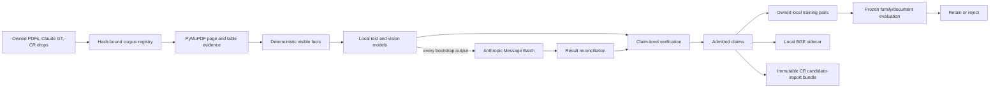

# Datasheet Extraction Factory

## Purpose

This factory converts owned datasheets, existing Claude ground truth, CR
exports, and local-model attempts into evidence-backed training pairs for the
local text and vision models.

Anthropic spend is authorized only as discounted Message Batch teacher spend.
The output of that spend is not a production answer and is not written directly
to CR. It must produce a source-bound teacher response, pass claim-level
verification, become an owned training pair, and then demonstrate measurable
local-model gain on frozen holdouts.

The economic success metrics are:

1. frontier cost per admitted local training pair;
2. local capability gain versus the frozen baseline;
3. paid-call replacement rate, with a 70% minimum promotion gate.

## Current sealed corpus

The 2026-09-01 inventory contains:

- 8,870 PDF files and 4,484 unique PDF SHA-256 lineages;
- 2,920 active Claude ground-truth records with no orphan GT records;
- 1,889 active published pinout records;
- 279,486 source-bound owned claims;
- 137,720 pin claims admitted for local training and embeddings;
- 33,889 pin claims isolated for frozen validation/test evaluation;
- 20 complete package records in the CR candidate-import bundle;
- 687 incomplete package groups withheld from CR import.

The full PyMuPDF page index covered all 4,484 unique documents with zero
document errors. It found at least one pin/ball section in 4,448 documents,
parametric sections in 4,352, summary sections in 4,463, and OPN-decoder
sections in 4,315. Exact package-column localization passed 1,990 package
requests and withheld 1,739 ambiguous or unsupported requests.

Canonical receipts:

- `results/datasheet-corpus-registry-20260901.json`
- `results/datasheet-owned-claims-20260901/`
- `results/datasheet-pinout-admissions-20260901/`
- `results/datasheet-page-index-20260901/`
- `results/pinout-vision-family-safe-cohort-20260901.json`
- `results/datasheet-factory-holdout-v3-20260901.json`
- `results/datasheet-structural-local-work-v8-20260901.json`
- `results/datasheet-local-priority-pin-v6-20260901.json`
- `results/datasheet-structural-local-work-v13-pin-semantic-balanced-20260901.json`
- `results/datasheet-extraction-frozen-cohort-v4-20260901/`
- `results/datasheet-extraction-frozen-cohort-v5-20260901/`
- `results/datasheet-extraction-frozen-cohort-v6-20260901/`
- `results/datasheet-deterministic-extraction-v2-20260901/`
- `results/datasheet-parametric-structural-work-v3-20260901.json`
- `results/datasheet-parametric-frozen-cohort-v2-20260901/`
- `results/datasheet-parametric-frontier-training-pairs-pilot-v3-0000-0004-20260901/`
- `results/datasheet-parametric-frontier-claim-admissions-pilot-v3-0000-0004-20260901/`
- `results/datasheet-parametric-frontier-embeddings-pilot-v3-0000-0004-20260901/`
- `results/datasheet-structural-dgx3-pilot-v7-0000-20260901/`
- `results/datasheet-structural-frontier-training-pairs-pilot-v7-0000-20260901/`
- `results/datasheet-structural-frontier-embeddings-pilot-v7-0000-20260901/`
- `results/datasheet-structural-frontier-training-pairs-shard-v8-0005-0024-20260901/`
- `results/datasheet-structural-frontier-embeddings-shard-v8-0005-0024-20260901/`
- `results/datasheet-electronics-teacher-dataset-v3-20260901/`
- `results/datasheet-electronics-teacher-dataset-v4-20260901/`
- `results/datasheet-electronics-teacher-dataset-v5-20260901/`
- `results/electronics-teacher-qwen3-vl-8b-mm-smoke-proof-v1-20260901.json`
- `results/electronics-qwen3-vl-30b-six-node-nccl-proof-v1-20260901.json`
- `results/electronics-30b-six-node-mm-smoke-proof-v1-20260901.json`
- `results/electronics-30b-bf16-dpo-proof-v1-20260901.json`
- `results/datasheet-frozen-qwen3vl30b-bf16-candidate-v2-dpo-six-node-proof-v1-20260901/`
- `results/datasheet-structural-shadow-frontier-candidates-v15-0000-0571-20260901/`
- `results/datasheet-structural-shadow-frontier-batch-v15-0000-0571-20260901/`
- `results/datasheet-structural-shadow-frontier-training-pairs-v15-0000-0571-20260901/`
- `results/datasheet-structural-shadow-frontier-claim-admissions-v15-0000-0571-20260901/`
- `results/datasheet-structural-shadow-frontier-embeddings-v15-0000-0571-20260901/`
- `results/datasheet-parametric-frontier-training-pairs-v19-0000-0199-20260901/`
- `results/datasheet-parametric-frontier-claim-admissions-v19-0000-0199-20260901/`
- `results/datasheet-parametric-frontier-embeddings-v19-0000-0199-20260901/`
- `results/pinout-vision-candidate-decision-v3-20260901.json`

The `v3` factory holdout supersedes the earlier same-day holdout drafts because
it canonicalizes manufacturer aliases before vendor stratification.

The structural `v8` queue supersedes `v6`/`v7`: it normalizes conflicting
ground-truth package counts, requires unique work IDs, and rejects selection
guides that merely contain package names and numeric-looking columns. The
pin-focused priority rebuild found additional package-scoped pages outside the
old two-pages-per-document cap. Queue `v13` seals 334 unused package-scoped
semantic work items:
304 contain grounded direction values, 200 contain grounded type values, and
330 contain function or description values. Every selected page has at least
two populated semantic roles. The current frozen extraction cohort is `v6`.

## First 25 structural teacher records

The 2026-09-01 package-scoped bootstrap exercised 25 records through the
complete pillar. Six local text answers were retained and 19 used focused-image
fallback. All 25 records, including low-confidence and empty local answers,
were sent to independent Anthropic Message Batch teachers. The two batches
cost $0.256656 total.

Seventeen teacher answers passed exact source-row and package verification;
eight were quarantined. Four quarantines exposed a locator error: a product
ordering guide had package names and numeric fields but no pin-definition
header. Both local and frontier models returned no pins. That evidence caused
the structural-v8 veto above; empty output was not converted into a positive
training target.

The combined sealed outputs contain 17 SFT pairs, 16 local-versus-teacher
preference pairs, 151 admitted source-grounded claims, and 151 local BGE-M3
embeddings. Frontier cost per admitted SFT pair was $0.01510. The portable
teacher dataset has 14 document-lineage-safe training examples and three
validation examples, with zero overlap against frozen extraction cohort v4.
None of these partial package pages is admitted to CR import.

A two-step Qwen3-VL-8B multimodal LoRA smoke then loaded this dataset on DGX2,
updated the vision blocks, multimodal merger, and language model, and saved a
210,082,848-byte adapter. Both losses and gradient norms were finite. The
adapter contains 232 visual, four merger, and 504 language LoRA tensors. This
proves the hardware/data/training path; two steps are not promotion evidence.

Separately, the frozen 160-example Qwen3-VL-8B row-crop evaluation improved pin
identity F1 from 0.2032 to 0.5087 and weighted utility from 0.2051 to 0.5598.
The candidate remains rejected for promotion because the precommitted identity
F1 gate is 0.80.

## Current 30B learning cycle

All six switched boxes passed a six-rank NCCL all-reduce and then completed a
two-step Qwen3-VL-30B multimodal LoRA qualification. The sealed adapter has
nonzero updates in visual, merger, and language blocks. A mandatory
post-training generation sanity check then rejected that FP8 training path:
the Transformers loader dropped FP8 MoE scale tensors and the untouched base
model itself emitted invalid text. The receipt therefore proves six-node
NCCL/DDP and adapter writes only. FP8 remains the local vLLM inference model;
the pinned BF16 30B checkpoint is required for valid training and frozen
base-versus-adapter evaluation.

The first four-way 30B shadow pass covered 572 work items. A service failure is
not a model answer: 123 infrastructure-failed items remain retryable and were
withheld. Every one of the other 449 completed local attempts, including
evidence-gate passes, was sealed as a teacher candidate. Anthropic Message
Batch returned all 449 answers for $8.359883; 58 failed schema and only eight
passed source verification because this delta queue was deliberately composed
of package-unresolved tables. The factory retained eight SFT pairs, seven
correction pairs, and 158 locally embedded claims, while quarantining the rest.
That low-yield cohort is negative localization evidence and must not be
repeated as an extraction-teacher cohort without a package-resolution lane.

The corrected parametric pilot admitted four of five teacher answers, emitted
four SFT/correction pairs, and admitted and locally embedded 190 source-row-
grounded value claims. The fifth answer was quarantined because 46 of its 56
facts could not be tied to one table row. Non-values such as dashes, blank
cells, and `N/A` are explicitly rejected.

The first production parametric tranche covered 200 local outputs and sent all
200 to Anthropic Message Batch. All requests completed in five minutes for
$5.287523; 199 parsed against the response schema. Claim-level verification
retained 1,651 independently same-row-grounded facts across 145 pages and
quarantined 3,703 individual facts plus 54 pages with no admissible fact. The
admitted output produced 145 sanitized SFT pairs, 145 local-versus-teacher DPO
pairs, 1,651 claim admissions, and 1,651 local 1,024-dimensional embeddings.
Mixed-quality pages are never trained wholesale: only the verified fact subset
is serialized as the teacher response.

Historical teacher dataset `v5` contains 283 SFT pairs, 277
local-versus-teacher preference pairs, and 257 unique focused images. It is no
longer authorized as a wholesale training source: a source replay found 28 of
127 pin-semantic SFT records that violate the corrected field-origin contract.
Its independently verified parametric source bundles remain reusable. All pin
records for the next dataset are re-extracted, re-taught, and reverified under
the corrected contract.

The six-node BF16 SFT candidate completed 114 optimizer steps. A subsequent
74-step DPO correction updated visual, merger, and language tensors and reached
0.7333 held-out preference accuracy. The original frozen pin gate rejected both
adapters, while parametric accuracy, exactness, and grounding remained 1.0.
Neither adapter is authorized for promotion.

A source audit subsequently proved that pin cohort `v4` could not support its
reported semantic conclusion. The label builder promoted `GPIO` from a
`Description` column into `type`, while the local context and image path failed
to isolate selected package columns for semantic tables. As a result, BGA
holdouts were labeled and answered with LQFP physical identifiers. The old
type/direction deltas are therefore invalid, not evidence that the adapters
truly regressed. Corrected cohort `v6` contains 216 source-grounded rows and
enforces package-column isolation, semantic field-to-header alignment, split
multi-pin cells, JSON nulls for separator cells, and preservation of numeric
pin `0`. Promotion remains fail-closed until a fresh base-versus-candidate
evaluation uses that cohort.

## Data flow



## Hard boundaries

- Existing owned facts are used before PyMuPDF, and PyMuPDF is used before a
  local model.
- Every parseable bootstrap answer is sent to Anthropic Message Batch after the
  local attempt so the factory can retain both the local answer and an
  independently generated teacher answer. Terminal local schema/no-answer
  failures are sent too. A service outage is retried and is not treated as a
  model answer.
- Every Anthropic request has a sealed maximum cost and uses Message Batches.
- Frontier output remains `ready_for_claim_verification`; it is never admitted
  automatically.
- Test and validation lineages are admitted only to frozen evaluation.
- A CR package record is emitted only when every physical pin identity and name
  is present without conflicts.
- The factory emits candidate-import bundles. It never writes directly to the
  CR database.
- CategoryRank, Tapes, customer data, and credentials remain outside this
  corpus.

## PDF extraction contract

The model is never asked to invent a complete component record from a broad
page match. Work is split into typed lanes:

1. physical pin/ball identity: exact package, printed pin/ball identifier, and
   printed signal name;
2. pin semantics: type, direction, alternate functions, and description only
   when printed for the same physical row;
3. parametrics: parameter, min/typ/max role, value, unit, conditions, and exact
   table row;
4. product identity: vendor, series/family, base part, OPN, package, and only
   explicitly printed ordering-code segments;
5. summary facts: only stated features and applications.

Lanes 1 and 2 are in the production bootstrap. Lane 3 now has structural
parametric-table localization, same-row source verification, frontier-teacher
claim shaping, correction-pair support, and a sealed 25-page holdout containing
360 value-level facts. The shadow-learning queue includes successful
deterministic parses as well as parser failures: 13,034 factory pages were
prioritized to 8,238 document-diverse candidates and filtered to 2,924 focused
parametric-table pages. The frozen 30B evaluation now scores lane 3 at 1.0
accuracy, exactness, grounding, and paid-call replacement for both base and
trained candidates across all 360 labeled facts. Lanes 4 and 5 have
source-grounding verifiers and bounded local pilots, but no frozen
qualification metric yet.

Each admitted value must retain the PDF SHA-256, page, package scope,
table/row/column or bounding box, source artifact SHA-256, and extraction
method. Missing values are JSON `null` or withheld. Package drawings and BGA
maps are corroboration evidence and cannot override definition tables.
Competitor matches are derived later from admitted parametric/application
claims and are never represented as facts extracted from the PDF.

The local pillar order is fixed:

`PyMuPDF blocks/tables → structural package/table geometry → deterministic
parser → pdftotext -layout only when deterministic evidence is incomplete →
local text extraction → focused package-column or parametric-table image only
if text is insufficient → local VLM → Anthropic batch teacher → source
verification`.

Full-page VLM extraction is prohibited for definition tables. A teacher answer
is still provisional: unsupported rows, combined physical identifiers,
unresolved package scope, and disagreement with owned ground truth are
quarantined rather than trained or imported.

## Runbook

Build the corpus join:

```bash
uv run --python 3.11 python scripts/inventory_datasheet_factory.py \
  --expected-pdf-files 8870 \
  --output results/datasheet-corpus-registry-20260901.json
```

Materialize existing owned claims and routes:

```bash
uv run --python 3.11 python scripts/materialize_datasheet_owned_claims.py \
  --corpus-registry results/datasheet-corpus-registry-20260901.json \
  --row-dataset /Volumes/M5_4TB/DigiKey_Reference_Designs/training_data_pinout_rows_v1 \
  --output-bundle results/datasheet-owned-claims-20260901 \
  --output-work-queue results/datasheet-extraction-work-queue-20260901.json
```

Index and extract source evidence:

```bash
uv run --python 3.11 --extra vision python scripts/index_datasheet_pages.py \
  --corpus-registry results/datasheet-corpus-registry-20260901.json \
  --workers 8 \
  --output-directory results/datasheet-page-index-20260901

uv run --python 3.11 --extra vision python scripts/extract_datasheet_page_evidence.py \
  --page-index results/datasheet-page-index-20260901 \
  --maximum-pages-per-lane 6 \
  --workers 8 \
  --output-directory results/datasheet-page-evidence-20260901
```

Build the fail-closed structural queue and run the local pillar:

```bash
uv run --python 3.11 python scripts/build_datasheet_structural_work_queue.py \
  --priority-queue results/datasheet-local-priority-20260901.json \
  --page-evidence results/datasheet-page-evidence-20260901 \
  --page-index results/datasheet-page-index-20260901 \
  --package-scope-policy require \
  --output results/datasheet-structural-local-work.json

uv run --python 3.11 --extra vision \
  python scripts/run_datasheet_structural_extraction.py \
  --structural-queue results/datasheet-structural-local-work.json \
  --page-evidence results/datasheet-page-evidence-20260901 \
  --base-url <private-local-openai-compatible-url> \
  --model <local-model-id> \
  --limit <bounded-shard-size> \
  --output-directory <local-shard>
```

Verify the local answers with `--frontier-policy all`, then prepare the
combined teacher batch:

```bash
uv run --python 3.11 python scripts/datasheet_frontier_batch.py prepare \
  --candidates <local-shard>/frontier-candidates.jsonl \
  --allowed-root <local-shard> \
  --model <anthropic-model-id> \
  --input-price-per-million <batch-input-price> \
  --output-price-per-million <batch-output-price> \
  --batch-discount 0.5 \
  --spend-cap-usd <explicit-cap> \
  --output <prepared-batch-directory>
```

Submission, status, retrieval, reconciliation, and finalization are separate
immutable transitions in `scripts/datasheet_frontier_batch.py`. Finalization
requires independent teacher-verification records and emits training pairs,
not database writes.

Promotion uses
`deploy/training/datasheet_factory_qualification.yaml`. All capability,
reproducibility, frontier-cost, paid-call-replacement, and CR-bundle gates must
pass.
